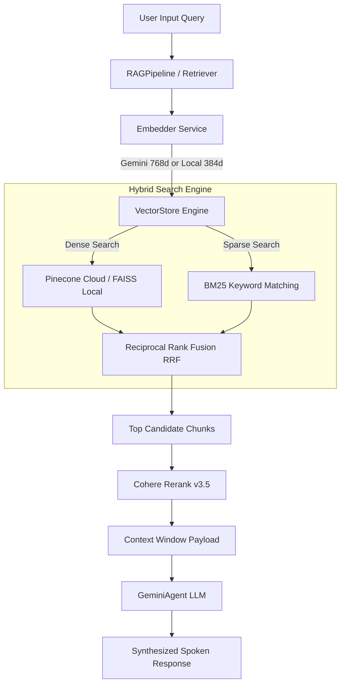

# 👁️ BlindAssist — Accessible Educational & Assistive Terminal

[](#)
[](#)
[](#)
[](#)

**BlindAssist** is an advanced, voice-controlled, gesture-enabled, and tactile educational terminal designed to assist visually impaired individuals. The system provides AI reading aids, natural voice queries, real-time document OCR, multi-language translation, GPS navigation, object/obstacle detection, and emotion-aware speech synthesis. 

It features an enterprise-grade **Retrieval-Augmented Generation (RAG)** engine supporting **Hybrid Search (BM25 + Dense Vectors)** and **Recursive Boundary Chunking** with cloud-to-local fallback capabilities.

---

## 📁 Project Directory Structure

```text
Blind-Assist/
├── README.md                          # Comprehensive project documentation
├── requirements.txt                   # System dependencies (Python packages)
└── Blindterminal/                     # Core application root
    ├── main.py                        # Central Orchestrator & State Machine
    ├── yolov8s.pt                     # YOLOv8 object detection weights
    ├── blindassist_detection.log      # Application runtime logs
    ├── config/                        # System configuration & model assets
    │   ├── settings.json              # API keys and audio parameters
    │   └── hand_landmarker.task       # MediaPipe gesture detection asset
    ├── modules/                       # Decoupled feature modules (Hardware & I/O)
    │   ├── __init__.py
    │   ├── ai_query.py                # Bridge between Orchestrator and RAG Pipeline
    │   ├── confidential_mode.py       # Privacy mode & silent alerting
    │   ├── emotion_engine.py          # Voice tone MFCC analyzer for speech modulation
    │   ├── gesture_control.py         # MediaPipe computer vision gesture recognition
    │   ├── gps_navigator.py           # Coordinate tracking & route spoken navigation
    │   ├── morse.py                   # Tactile Morse code input decoder
    │   ├── object_detection.py        # Real-time YOLOv8 obstacle & item detection
    │   ├── ocr.py                     # OpenCV & Tesseract OCR camera scanner
    │   ├── translator.py              # Multi-language translation engine
    │   ├── tts.py                     # Non-blocking pyttsx3 Text-to-Speech engine
    │   └── voice.py                   # SpeechRecognition microphone listener
    └── services/                      # Research-Grade RAG Architecture
        ├── __init__.py
        ├── embedder.py                # Dual-mode embedding service (Gemini / Local)
        ├── vector_store.py            # Hybrid Vector DB (Pinecone, FAISS, BM25, RRF)
        ├── retriever.py               # Candidate context retrieval & Cohere reranking
        ├── rag_pipeline.py            # RAG orchestration & Recursive Chunking
        └── gemini_agent.py            # LLM interface for Google Gemini API
```

---

## 🧠 Research-Grade RAG Architecture (`services/`)

The retrieval engine under `Blindterminal/services/` provides high-precision semantic groundedness and 100% offline resilience.



### 1. `services/embedder.py` (Dense Embeddings)
- **Dual-Mode Execution**: Dynamically uses Google Gemini Embedding API (`models/text-embedding-004`) when online, and automatically falls back to local `SentenceTransformers` (`all-MiniLM-L6-v2`) if offline.
- **Dynamic Dimension Management**: Exposes active vector dimensions (`.dimension = 768` for Gemini, `384` for local) to ensure vector store compatibility.

### 2. `services/vector_store.py` (Hybrid Search & Indexing)
- **Multi-Index Storage**: Supports Pinecone Cloud Vector DB, local FAISS flat indices (`index.faiss`), and persistent NumPy matrices.
- **BM25 Sparse Search**: Maintains an in-memory BM25 index over ingested text chunks for exact keyword lookups (e.g., textbook numbers, proper nouns).
- **Reciprocal Rank Fusion (RRF)**: Merges dense vector rankings with sparse BM25 rankings using standard RRF scoring:
  $$\text{RRF Score}(d) = \frac{1}{60 + \text{Rank}_{\text{Dense}}(d)} + \frac{1}{60 + \text{Rank}_{\text{BM25}}(d)}$$

### 3. `services/retriever.py` (Context Reranking)
- Fetches top candidates from the hybrid vector store and applies **Cohere Rerank v3.5** to rank context chunks by exact semantic relevance before passing them to the LLM.

### 4. `services/rag_pipeline.py` (Pipeline Orchestration)
- **Recursive Boundary Chunking**: Replaces naive character slicing with hierarchical splitting across natural semantic boundaries (`\n\n`, `\n`, `. `, `? `, `! `, ` `), ensuring words and thoughts are never split mid-sentence.
- Manages end-to-end document indexing (`index_document`) and context-augmented queries (`ask_question`).

### 5. `services/gemini_agent.py` (LLM Interface)
- Formulates strict prompts grounding Gemini responses inside retrieved textbook contexts to eliminate hallucinations.

---

## ⚙️ Core Feature Modules (`modules/`)

All modules follow a strict **Decoupled Architecture** and communicate exclusively through the orchestrator (`main.py`).

| Module | Functionality & Working Mechanism | Tech Stack |
|---|---|---|
| **`tts.py`** | Non-blocking spoken readout of text, system alerts, and menu navigation using worker queues to avoid blocking the main execution thread. | `pyttsx3`, `pygame.mixer` |
| **`voice.py`** | Captures microphone audio, calibrates ambient noise, and converts spoken voice into text queries. | `SpeechRecognition`, `PyAudio` |
| **`ocr.py`** | Captures camera frames, applies OpenCV image preprocessing, extracts document text via Tesseract, and feeds it into RAG indexing. | `opencv-python`, `pytesseract` |
| **`ai_query.py`** | High-level controller coordinating RAG textbook queries and direct conversational AI modes. | Internal RAG Pipeline |
| **`gesture_control.py`** | Computer vision module processing live webcam frames to detect hand landmarks and recognize gestures (Open Palm, V-Sign, Thumbs Up, Fist). | `mediapipe`, `opencv-python` |
| **`object_detection.py`** | Real-time object and obstacle detection announcing surrounding objects and distances for spatial awareness. | `ultralytics` (YOLOv8s), OpenCV |
| **`gps_navigator.py`** | Geocoding and route planning service generating spoken step-by-step navigation instructions. | OpenStreetMap Nominatim / OSRM |
| **`emotion_engine.py`** | Analyzes voice tone pitch and MFCC audio features; slows down TTS speech rate if acoustic confusion/stress is detected. | `librosa`, `scikit-learn` |
| **`translator.py`** | Translates educational content and spoken responses between English, Hindi, and Gujarati. | `googletrans` |
| **`morse.py`** | Decodes tactile dot/dash inputs from physical switches or keyboard keys into alphanumeric commands for silent operation. | Custom timing state machine |
| **`confidential_mode.py`** | Toggles silent audio readout and requires explicit user confirmation for private notifications. | System state flags |

---

## 🏛️ System Architecture & Execution Flow

BlindAssist follows a **Star Topology** for software decoupling:
*   **Orchestrator (`main.py`)**: Central state machine managing system modes, handling user triggers, and passing data between isolated modules.
*   **Decoupled Modules (`modules/`)**: Modules do **not** import each other. All inter-module events are routed through `main.py`.
*   **Laptop Simulation vs. Pi Mode**: Hardware flags allow seamlessly toggling between **Laptop Simulation Mode** (webcam, laptop mic/speakers, keyboard simulation) and **Pi Production Mode** (Pi Camera v3, GPIO buttons, hardware GPS HAT, bone conduction audio).

---

## 🚀 Setup & Running

### 📋 Prerequisites
1. **Python 3.10+** (tested on Python 3.13)
2. **Tesseract OCR Engine**:
   - macOS: `brew install tesseract`
   - Linux: `sudo apt install tesseract-ocr`

### 💻 Installation

1. Clone the repo and install dependencies:
   ```bash
   git clone https://github.com/Daxptl7/Blind-Assist.git
   cd Blind-Assist
   pip3 install -r requirements.txt
   ```

2. Configure API Keys in `Blindterminal/config/settings.json`:
   ```json
   {
     "gemini_api_key": "YOUR_GEMINI_API_KEY",
     "cohere_api_key": "YOUR_COHERE_API_KEY",
     "pinecone_api_key": "YOUR_PINECONE_API_KEY"
   }
   ```

3. Run the complete integrated terminal:
   ```bash
   python3 Blindterminal/main.py
   ```

---

## 👥 Authors & Credits
*   **Dhruv Vaghela** — CSR/Infineon Technologies 2025
*   **Dax Patel** — CSR/Infineon Technologies 2025