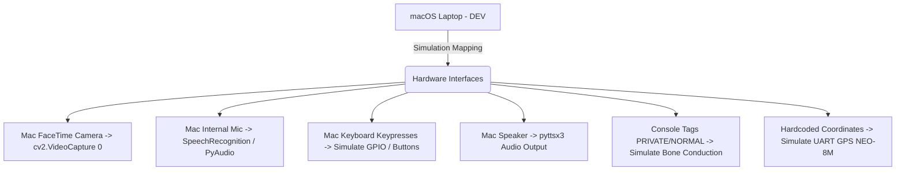

# BlindAssist: Project Status & Module Analysis

This document provides a comprehensive status update and technical roadmap for the **BlindAssist** Accessible Educational Terminal. It details completed work, remaining modules, and a technical plan for testing on a standard macOS laptop before deployment to the Raspberry Pi 5.

---

## 1. Executive Summary

**BlindAssist** is a screenless, tactile-first educational terminal built around the **Raspberry Pi 5** for visually impaired users. Key characteristics include:
- **Interaction Model**: 3 tactile buttons for Morse code typing and navigation, voice commands, hand gestures, and spoken text-to-speech (TTS) output.
- **Pi Flag Pattern**: Abstracting physical hardware via flags (`HEADLESS`, `USE_PICAMERA`, `USE_GPIO`, etc.) to support seamless, dual-environment execution (Mac/Laptop during development vs. Pi 5 in production).

---

## 2. Software Module Analysis

We cross-referenced the requirements listed in the Master Plan and Claude Code Context with the actual files inside the `Blindterminal/` directory.

### 2.1 Summary Table

| Module / File Name | Target Purpose | Size on Disk | Current Status | Notes / Logic Present |
| :--- | :--- | :--- | :--- | :--- |
| **`tts.py`** | Centralized audio queue, TTS outputs | 10 KB | **DONE** | Multi-threaded offline `pyttsx3` output. Saves speech as `.wav` locally. |
| **`morse.py`** | Decodes button presses to letters/words | 11 KB | **DONE** | Morse dictionary, gap-based character & word delimiter decoding, keyboard simulator. |
| **`ocr.py`** | Preprocessing & Tesseract OCR | 11 KB | **DONE** | 7-step pre-process (upscale, gray, denoise, deskew, threshold, morphology) + Tesseract. |
| **`object_detection.py`**| YOLOv8 object recognition | 18 KB | **DONE** | Pre-processes frames using CLAHE. Color-coded bounding boxes. Proximity assessment. |
| **`voice.py`** | Voice-to-text input (Speech recognition) | 0 bytes | 🔴 **REMAINING** | Needs SpeechRecognition with Google Speech API or offline Whisper. |
| **`ai_query.py`** | OpenAI / Gemini / Offline LLM reasoning | 0 bytes | 🔴 **REMAINING** | Needs Gemini/OpenAI API routing and offline TinyLlama runner. |
| **`translator.py`** | Multilingual translations | 0 bytes | 🔴 **REMAINING** | Translates OCR/AI text between English, Hindi, and Gujarati. |
| **`gesture_control.py`** | MediaPipe hand gesture mode selection | 0 bytes | 🔴 **REMAINING** | Detects landmarks (open palm, fist, thumbs up, etc.) and raises events. |
| **`emotion_engine.py`** | Adaptive TTS speed based on vocal stress | 0 bytes | 🔴 **REMAINING** | Extracts MFCCs using `librosa` and classifies via SVM. |
| **`gps_navigator.py`** | GPS coordinate parsing and routing | 0 bytes | 🔴 **REMAINING** | Reads UART serial data, performs geocoding, and handles navigation. |
| **`confidential_mode.py`**| Audio output privacy routing | 0 bytes | 🔴 **REMAINING** | Handles ALSA switching between normal speaker and bone conduction. |
| **`main.py`** | Main orchestrator & state machine | 4 KB | ⚠️ **PARTIAL** | Currently a basic RAG pipeline wrapper for text input. Needs Morse mode loop. |

---

## 3. macOS Simulation & Porting Strategy

Since Raspberry Pi 5 hardware is not connected, the codebase is designed to run seamlessly on a macOS environment. The mapping below shows how hardware modules are simulated on a Mac.



### 3.1 Key Mappings for Mac Testing
1. **Camera Input**:
   - Uses the built-in macOS webcam via standard OpenCV interface (`cv2.VideoCapture(0)`).
   - In `ocr.py` and `object_detection.py`, `USE_PICAMERA = False` triggers standard USB/built-in webcam capture.
2. **Tactile Buttons**:
   - `USE_GPIO = False` disables GPIO imports (which fail on macOS) and switches input loops to standard keyboard simulation:
     - **Dot**: Period key (`.`)
     - **Dash**: Hyphen key (`-`)
     - **Confirm Word**: `Enter`
     - **Space**: `Tab` or `Shift+Enter`
     - **Delete last character**: `Backspace`
3. **Voice Input (Speech-to-Text)**:
   - Uses `SpeechRecognition` library configured to capture audio from the default macOS microphone source via PyAudio.
4. **Bone Conduction (Confidential Mode)**:
   - Bone conduction requires a PAM8403 amplifier enabled via GPIO and a secondary USB Sound card configured via ALSA.
   - On macOS, this will print a `[PRIVATE]` tag to the terminal console and mute/unmute the speaker to simulate routing audio to the bone transducer.
5. **GPS**:
   - Returns mock GPS coordinate values for Indore, India, allowing the geocoding APIs and walking direction pipelines to run successfully.

---

## 4. Proposed Development Roadmap

Following the architectural guidelines, we must build **one module at a time** and write `__main__` test blocks for each. Here is the recommended order:

```
  Step 1: voice.py (Speech-to-Text via Mic)
    │
    ▼
  Step 2: ai_query.py (Connects Morse/Voice query to Gemini/ChatGPT)
    │
    ▼
  Step 3: translator.py (Translates text between Eng/Hindi/Gujarati)
    │
    ▼
  Step 4: gesture_control.py (MediaPipe hand landmarks scanner)
    │
    ▼
  Step 5: emotion_engine.py (Librosa voice stress classifier)
    │
    ▼
  Step 6: gps_navigator.py (Geocoding & turn directions)
    │
    ▼
  Step 7: confidential_mode.py (Dual audio router wrapper)
    │
    ▼
  Step 8: main.py (Tie all modules into the main Morse mode selector)
```

---

## 5. Verification Plan on macOS

For each module built:
1. **Unit Verification**: Run `python3 Blindterminal/modules/<module_name>.py` standalone on your Mac to test.
2. **Warmup & Safety Checks**: Ensure all webcam operations discard at least 5 auto-exposure warmup frames, wrap camera streams in `try/finally` blocks, and clean up resources on keyboard interrupt (`Ctrl+C`).
